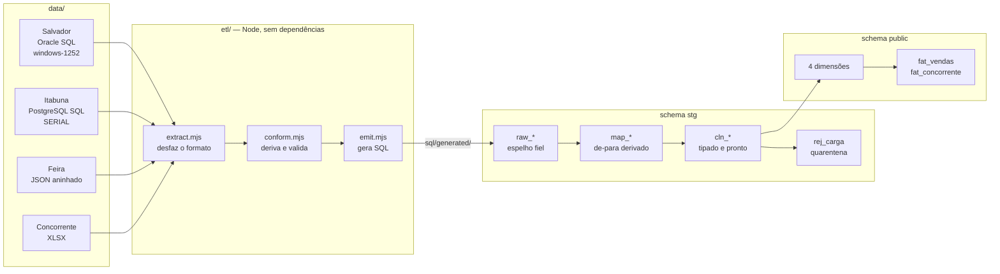
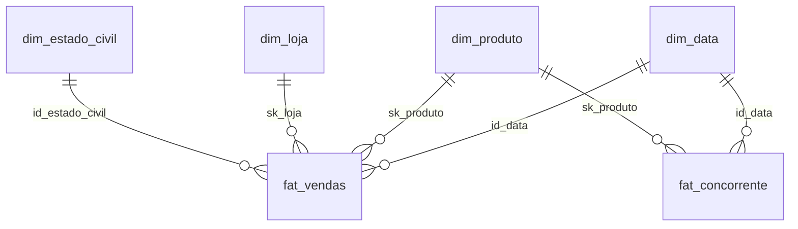

# PetShop Nosso Aumigo — Data Warehouse e ETL

Integra quatro fontes heterogêneas de três lojas de petshop, mais o faturamento
de um concorrente, num modelo dimensional PostgreSQL hospedado no Supabase.

O trabalho difícil aqui não é o volume — são **6.621 linhas no grão de item**,
nada para um banco. É a **heterogeneidade**: dois dialetos SQL, três formatos de
arquivo, dois encodings, três domínios diferentes para o mesmo campo e chaves
naturais que colidem entre as fontes.

---

## Índice

- [Status](#status)
- [Arquitetura](#arquitetura)
- [As quatro fontes](#as-quatro-fontes)
- [O modelo dimensional](#o-modelo-dimensional)
- [Os problemas que o ETL resolve](#os-problemas-que-o-etl-resolve)
- [Como rodar](#como-rodar)
- [Como o pipeline falha](#como-o-pipeline-falha)
- [Estrutura do repositório](#estrutura-do-repositório)
- [Consultas úteis](#consultas-úteis)
- [Documentação](#documentação)

---

## Status

Pipeline executado com sucesso. Estado atual do DW:

| Tabela | Linhas |
|---|---:|
| `dim_data` | 6 (grão quadrimestral) |
| `dim_produto` | 18 (17 produtos + 1 sentinela) |
| `dim_loja` | 3 |
| `dim_estado_civil` | 6 |
| `fat_vendas` | **6.621** |
| `fat_concorrente` | 6 (24 meses agregados) |

**Receita total: R$ 1.309.440,83**, batendo exatamente com o cálculo feito
direto dos arquivos de origem, sem passar pelo ETL. Zero linhas rejeitadas.

| Loja | Itens 2024 | Itens 2025 | Receita 2024 | Receita 2025 |
|---|---:|---:|---:|---:|
| Salvador | 1.623 | 1.543 | R$ 273.441,60 | R$ 271.661,50 |
| Itabuna | 858 | 899 | R$ 227.315,02 | R$ 234.662,51 |
| Feira de Santana | 823 | 875 | R$ 144.764,40 | R$ 157.595,80 |

---

## Arquitetura



O ETL **não escreve no banco**. Ele gera SQL em `sql/generated/`, e um executor
separado aplica. Três razões: o SQL gerado é revisável antes de rodar, vira o
registro auditável do que foi carregado, e o MCP configurado é `--read-only`.

### As quatro camadas do staging

| Camada | Papel |
|---|---|
| `raw_*` | Espelho fiel da fonte. **Tudo `text`, zero constraint.** `'15/01/2025'` entra como veio |
| `map_*` | Catálogo conformado e de-para. É o que resolve a colisão de chaves |
| `cln_*` | Tipado, com os mesmos tipos do destino e as mesmas constraints |
| `rej_carga` | Quarentena, com o motivo e a linha original em `jsonb` |

Replicar as constraints do destino em `cln_*` é deliberado: é melhor falhar no
staging, onde a linha pode ser inspecionada, do que num `INSERT` final em que
uma linha ruim aborta a carga inteira.

---

## As quatro fontes

| Fonte | Formato | Vendas | Itens | Período |
|---|---|---:|---:|---|
| **Salvador** | Oracle SQL (`windows-1252`) | 900 | 3.166 | 2024-01-01 → 2025-12-28 |
| **Itabuna** | PostgreSQL SQL (`SERIAL`) | 500 | 1.757 | 2024-01-01 → 2025-12-28 |
| **Feira de Santana** | JSON aninhado | 500 | 1.698 | 2024-01-07 → 2025-12-28 |
| **Concorrente** | XLSX | — | 24 | 2024-01 → 2025-12 |

Cada uma trouxe um problema próprio:

**Salvador** é o único arquivo que **não é UTF-8** — falha no byte 8, o `ç` de
`Rações` em cp1252. Usa dialeto Oracle (`TO_DATE`, `SYSDATE`, `VARCHAR2`) que não
executa no PostgreSQL. É a única fonte com `categorias` normalizada em tabela
própria, e a única com o catálogo completo de 17 produtos — mas 5 deles têm
`id_categoria NULL`.

**Itabuna** usa `SERIAL` e **os `INSERT` não informam a PK**: o id da entidade é
a posição no arquivo. Reordenar o arquivo mudaria as chaves. Tem produto
duplicado no próprio cadastro (15 linhas, 13 nomes) e uma coluna `valor_total`
que **diverge da soma dos itens em 500 de 500 vendas**. É a única com serviços
(300 atendimentos), que não têm destino no modelo.

**Feira** é a fonte mais limpa: `valor_total` bate em 500 de 500 pedidos, preços
conferem com o catálogo em 1.698 de 1.698 itens, zero órfãos. Os itens vêm
aninhados dentro do pedido e precisam ser achatados. Tem 10 clientes sem estado
civil.

**Concorrente** tem três colunas — `Ano`, `Mês`, `Vendas (R$)`. Sem produto, sem
quantidade, sem dia. É lido com `zlib` e um parser de ZIP próprio, sem
biblioteca externa.

---

## O modelo dimensional

Star schema com duas tabelas de fato que compartilham `dim_data` e `dim_produto`.



| Tabela | Tipo | Grão |
|---|---|---|
| `dim_produto` | **SCD tipo 2** | Uma versão por produto por vigência |
| `dim_loja` | **SCD tipo 2** | Uma versão por loja por vigência |
| `dim_estado_civil` | Estática | Um rótulo |
| `dim_data` | Calendário | Um **quadrimestre** (`ano`, `quadrimestre`) |
| `fat_vendas` | Fato | **Um item de venda** |
| `fat_concorrente` | Fato | Um **quadrimestre** agregado |

O SCD2 é garantido **pelo banco**, não por convenção de ETL:

```sql
CONSTRAINT ex_produto_per EXCLUDE USING gist (
    id_produto WITH =,
    tsrange(data_inicio, data_fim) WITH &&
)
CREATE UNIQUE INDEX ux_produto_atual ON dim_produto (id_produto) WHERE flag_atual;
```

A exclusion constraint impede vigências sobrepostas; o índice único parcial
impede duas versões correntes. Inserir versão nova sem fechar a anterior é
rejeitado pelo Postgres — por isso a carga de dimensão é sempre um delta
calculado, e não um `INSERT` direto.

> **Atenção ao `quadrimestre`:** são períodos de **4 meses, 3 por ano**
> (1 = jan–abr, 2 = mai–ago, 3 = set–dez). Não é trimestre.
>
> **`dim_data` tem grão quadrimestral — 6 linhas, e não existe data em lugar
> nenhum do schema `public`.** A chave é `id_data`, surrogate sequencial 1..6.
> Análise mensal ou diária é impossível no DW; a data real da venda fica em
> `stg.cln_fat_vendas`. Ver [docs/07](docs/07-bloqueios-de-modelagem.md#3-dim_data--grão-quadrimestral).
>
> Como `id_data` não carrega significado, ordene por `ano, quadrimestre` —
> nunca por `id_data`.

---

## Os problemas que o ETL resolve

Esta seção é o coração do projeto. Cada item abaixo é uma decisão registrada.

### 1. As chaves naturais colidem entre as fontes

O mesmo `id_produto` significa produtos **diferentes** em cada loja:

| Produto | Salvador | Itabuna | Feira |
|---|---:|---:|---:|
| Ração Premium Cães | 1 | 14 | 1 |
| Caixa de Transporte | 17 | 7 | 15 |
| **Bebedouro Automatico** | **15** | 11 | — |
| **Escova para Pelos** | 16 | **15** | — |
| Corda Mordedor | 8 | **3 e 13** | 8 |
| Tapete Higiênico Premium | 13 | **1 e 10** | 13 |

Leia a linha `id_origem = 15`: é *Bebedouro* em Salvador, *Escova* em Itabuna e
*Caixa de Transporte* na Feira. E `dim_produto` tem chave natural **global**
(`UNIQUE (id_produto) WHERE flag_atual`), sem coluna de fonte.

Carregar a segunda fonte violaria o índice único. Não existe ordem de carga que
resolva — é preciso conformar num catálogo único de 17 produtos e manter um
de-para `(fonte, id_origem) → id_conformado`, que não cabe em lugar nenhum do
modelo dimensional. **É a justificativa central para a área de staging.**

Os 47 mapeamentos são **derivados** por agrupamento de nome normalizado (sem
acento, minúsculo), não digitados à mão.

### 2. `fat_vendas` tem PK em `id_venda` mas grão de item

O destino não muda, então o ETL absorve o conflito. Não serve usar o número da
venda na origem (as três fontes numeram a partir de 1) nem `(venda, produto)`
(existem **592 casos** de produto repetido no mesmo pedido). A chave é gerada
assim:

```
id_venda = id_loja × 1.000.000.000 + id_venda_origem × 100 + seq_item
```

Formato **decodificável** de propósito, em vez de um contador opaco:

```
1000000101  →  loja=1  venda=1    item=1   (Salvador)
2000001004  →  loja=2  venda=10   item=4   (Itabuna)
3000050005  →  loja=3  venda=500  item=5   (Feira)
```

Assim `id_venda / 100` reagrupa os itens do mesmo pedido original e
`id_venda / 1000000000` devolve a loja — a informação que uma PK em `id_venda`
pareceria destruir fica preservada. O script **falha** se algum id exceder os
fatores, em vez de gerar chave colidida em silêncio.

### 3. `fat_concorrente` exige colunas que a fonte não tem

A tabela pede `sk_produto` e `quantidade` `NOT NULL`, mas o XLSX é faturamento
mensal agregado. A solução usa membros sentinela:

- `sk_produto` → membro `Não aplicável` (`id_produto = 999`)
- `quantidade` → `0`, permitido porque o `CHECK` aqui é `>= 0`, ao contrário do
  `> 0` de `fat_vendas`
- `id_data` → o quadrimestre em que o mês cai

Como `dim_data` é quadrimestral e a fonte é mensal, os **24 meses são somados
em 6 linhas** pelo conformador ([etl/conform.mjs](etl/conform.mjs)). É o único
ponto do pipeline em que N linhas viram 1, então tem validação em três camadas:

| Camada | Garantia |
|---|---|
| `conform.mjs` | falha se a soma dos valores ou a contagem de meses não fechar |
| `stg.vw_check_agregacao_concorrente` | `sum(meses_agregados)` tem que dar 24 |
| `40_load_dw.sql` | compara `sum(valor_venda)` entre staging e destino antes do `COMMIT` |

> **`SUM(quantidade)` em `fat_concorrente` é sempre 0 e significa "não medido na
> origem", nunca "vendeu zero unidades".** Só a comparação de **valor** entre
> empresa e concorrente é válida com os dados fornecidos.

> **O mês do concorrente não existe no DW.** Depois da agregação ele sobrevive
> apenas em `stg.raw_concorrente`.

### 4. Três domínios para `estado_civil`

| Fonte | Formato | Valores |
|---|---|---|
| Salvador | `VARCHAR(1)` | `C` `D` `S` `U` `V` |
| Itabuna | `VARCHAR(20)` | texto completo |
| Feira | JSON string | texto completo, **10 nulos** |

O de-para de Salvador é pela inicial — inequívoco, mas é uma **interpretação**:
nenhuma fonte documenta a legenda. Por isso mora em `config.mjs`, não em código
derivado. Os 10 nulos da Feira afetam 193 linhas de fato e recebem o membro
`Não informado`, já que `fat_vendas.id_estado_civil` é `NOT NULL`.

### 5. Dados que não podem ser confiados como vêm

O `valor_total` do Itabuna diverge da soma dos itens em **500 de 500** vendas
(`id_venda=1`: 34,93 declarado vs 711,76 somado). A coluna é **descartada** e o
valor derivado de `quantidade × valor_unitario`. Ela continua em `stg.raw_venda`
de propósito: é o registro de que existia e divergia.

### 6. Categoria herdada em vez de "Não informado"

Os 5 produtos que Salvador tem com `id_categoria NULL` têm categoria nas outras
fontes. O ETL escolhe a categoria mais frequente entre as fontes, e **todos os 5
foram recuperados** — nenhum precisou virar "Não informado".

### 7. Grafia sem inventar acento

Escolhe a variante com mais caracteres acentuados (`Ração Premium Cães` da Feira
vence `Racao Premium Caes` de Salvador). Produtos ausentes da Feira ficam com a
grafia sem acento da origem, e o script **reporta quais são** — é por isso que
`Bebedouro Automatico` aparece sem acento: nenhuma fonte o grafa acentuado.

---

## Como rodar

### Pré-requisitos

**Node ≥ 22.** O ETL usa só a stdlib — nenhuma dependência para gerar o SQL. O
`pg` do `package.json` é usado apenas pelo executor `etl/deploy.mjs`.

```powershell
npm ci
```

### 1. Verificar

```powershell
npm test              # suíte de testes
node etl/main.mjs --dry   # relatório completo, não escreve arquivo
```

### 2. Gerar a carga

```powershell
node etl/main.mjs
```

Cria em `sql/generated/`:

| Arquivo | Tamanho | Conteúdo |
|---|---:|---|
| `10_stg_raw.sql` | ~909 KB | Espelho das fontes |
| `20_stg_map.sql` | ~5 KB | Catálogo e de-para derivados |
| `30_stg_cln.sql` | ~506 KB | As 6.621 linhas conformadas |
| `40_load_dw.sql` | ~9 KB | Carga no `public`, com validação |
| `manifest.json` | — | `id_carga`, SHA-256 e tamanho das 8 fontes |

Cada execução tem UUID próprio. O manifesto permite provar exatamente quais
arquivos produziram o lote.

### 3. Carregar no Supabase

No painel, **Connect → Session pooler**, copie a string e **remova a senha**.
Use a porta **5432** — a 6543 é o Transaction pooler, que não sustenta os
`SET LOCAL` e as transações longas do preflight.

```powershell
# inspeciona e valida o destino, sem escrever
npm run deploy -- --project-ref <REF> --database-url "<URL_SEM_SENHA>" --skip-generate --check

# aplica
npm run deploy -- --project-ref <REF> --database-url "<URL_SEM_SENHA>" --skip-generate --yes
```

`--skip-generate` preserva o `id_carga` já gerado; sem ele o deploy regenera
tudo e o `manifest.json` conferido deixa de valer.

O executor valida o `project-ref` contra o host, bloqueia destino que não
pertença ao projeto declarado, pede a senha sem exibir nem gravar, e aplica na
ordem parando no primeiro erro:

```
00_preflight.sql   →  ajusta e valida o DW existente
02_stg_ddl.sql     →  cria/atualiza o schema stg
10_stg_raw.sql  →  20_stg_map.sql  →  30_stg_cln.sql  →  40_load_dw.sql
```

O `01_dw_ddl.sql` só roda num banco zerado — o executor detecta se as 6 tabelas
já existem. Esquema parcial (1 a 5 tabelas) aborta a carga para revisão manual.

Há também [`deploy.ps1`](deploy.ps1), que faz o mesmo via `psql` lendo tudo do
`.env`, com `-v ON_ERROR_STOP=1`.

### Variáveis de ambiente

Copie `.env.example` para `.env`:

| Variável | Uso |
|---|---|
| `PETSHOP_SUPABASE_PROJECT_REF` | Trava de destino do deploy |
| `DATABASE_URL` | Conexão Postgres (Session pooler, porta 5432) |
| `SUPABASE_ACCESS_TOKEN` | MCP e Management API |
| `SUPABASE_PROJECT_REF` | MCP |

> `.env` e `.mcp.json` estão no `.gitignore`. Nunca commite credenciais — e se
> um token já foi escrito em texto puro, rotacione em vez de só removê-lo.

---

## Como o pipeline falha

Falhar cedo e alto é uma decisão de projeto. **Perda silenciosa é o pior modo de
falha de um ETL.**

### O ETL quebra (exit 1) quando

- um valor de estado civil não tem correspondência no config
- um produto não tem categoria em fonte nenhuma
- um id de venda ou contagem de itens excede os fatores da chave
- a reconciliação não fecha: *itens da origem ≠ conformados + rejeitados*
- o número de produtos distintos difere do esperado

### Avisa, mas segue

Contagem de arquivo divergente, categoria divergente entre fontes, grafia não
confirmada, produto duplicado, telefone com DDD inesperado, `valor_total`
divergente.

### Na carga

Linhas individuais que não podem virar fato vão para `stg.rej_carga`, ligadas ao
`id_carga`, com o motivo e a linha original. O `40_load_dw.sql` **valida antes
do `COMMIT`** — se alguma linha limpa não chegar ao destino, a transação inteira
faz rollback. Advisory locks impedem cargas concorrentes.

O estado de cada execução fica em `stg.etl_carga`
(`iniciada → extraida → mapeada → transformada → concluida`, ou `falhou` com a
mensagem).

---

## Estrutura do repositório

```
data/                     8 arquivos de origem, intocados
docs/                     documentação do modelo e das fontes
etl/
  config.mjs              decisões humanas irredutíveis — e SÓ elas
  extract.mjs             8 arquivos -> registros (desfaz formato)
  conform.mjs             deriva catálogo, de-para, fatos; valida
  emit.mjs                registros -> SQL
  main.mjs                orquestra e relata
  deploy.mjs              aplica no Supabase, com trava de destino
  lib/zip.mjs             leitor de ZIP/XLSX (stdlib)
  lib/sqlparse.mjs        parser de INSERT (Oracle + PostgreSQL)
sql/
  00_preflight.sql        ajusta e valida o DW existente
  01_dw_ddl.sql           DDL do modelo (só para banco zerado)
  02_stg_ddl.sql          schema stg completo
  generated/              SQL gerado — descartável, fora do git
test/etl.test.mjs         suíte de testes
deploy.ps1                alternativa via psql
```

### A regra que separa `config.mjs` do resto

Se um valor **pode** ser derivado dos arquivos, ele **não** pode estar no config.
Só entra ali o que não existe em lugar nenhum nos dados:

| Decisão | Por que é irredutível |
|---|---|
| Nome das lojas | A loja não é coluna em nenhuma fonte |
| Legenda `C`/`D`/`S`/`U`/`V` | Nenhuma fonte documenta o que as letras significam |
| Membro `Não informado` | 10 nulos contra uma coluna `NOT NULL`: é escolha, não dado |
| Produto sentinela | A fonte do concorrente não tem produto |
| Numeração canônica | Os ids colidem; alguma fonte tem que ser eleita |
| Fatores da chave de fato | Convenção de codificação |

Os 17 produtos, os 47 mapeamentos, a categoria herdada e a grafia escolhida
**saem dos arquivos**.

---

## Consultas úteis

```sql
-- Receita por loja e ano
SELECT l.loja, d.ano, count(*) AS itens, round(sum(f.valor_venda), 2) AS receita
FROM fat_vendas f
JOIN dim_loja l ON l.sk_loja = f.sk_loja
JOIN dim_data d ON d.id_data = f.id_data
GROUP BY 1, 2 ORDER BY 1, 2;

-- Quadrimestres de 2024 (1 = jan-abr, 2 = mai-ago, 3 = set-dez)
SELECT d.quadrimestre, count(*) AS itens, round(sum(f.valor_venda), 2) AS receita
FROM fat_vendas f
JOIN dim_data d ON d.id_data = f.id_data
WHERE d.ano = 2024
GROUP BY 1 ORDER BY 1;

-- Análise mensal NÃO é possível no DW: dim_data é quadrimestral e não há data
-- em public. O detalhe diário sobrevive no staging:
SELECT extract(month from c.data)::int AS mes, round(sum(c.valor_venda), 2)
FROM stg.cln_fat_vendas c WHERE extract(year from c.data) = 2024
GROUP BY 1 ORDER BY 1;

-- Empresa vs concorrente (só VALOR é comparável, nunca quantidade)
SELECT d.ano,
       round(sum(f.valor_venda), 2) AS nossa_receita,
       (SELECT round(sum(c.valor_venda), 2)
          FROM fat_concorrente c
          JOIN dim_data dc ON dc.id_data = c.id_data
         WHERE dc.ano = d.ano) AS concorrente
FROM fat_vendas f JOIN dim_data d ON d.id_data = f.id_data
GROUP BY d.ano ORDER BY d.ano;

-- Diferença entre dois anos consecutivos, por produto (indicador 8)
SELECT p.produto,
       sum(f.quantidade) FILTER (WHERE d.ano = 2024) AS qtd_2024,
       sum(f.quantidade) FILTER (WHERE d.ano = 2025) AS qtd_2025,
       sum(f.quantidade) FILTER (WHERE d.ano = 2025)
     - sum(f.quantidade) FILTER (WHERE d.ano = 2024) AS diferenca
FROM fat_vendas f
JOIN dim_data d    ON d.id_data    = f.id_data
JOIN dim_produto p ON p.sk_produto = f.sk_produto
GROUP BY 1 ORDER BY 4 DESC;

-- Decodificar a chave de fato
SELECT id_venda,
       (id_venda / 1000000000)::int        AS id_loja,
       ((id_venda % 1000000000) / 100)::int AS venda_na_origem,
       (id_venda % 100)::int                AS item
FROM fat_vendas LIMIT 5;

-- Auditoria: o que ficou de fora e por quê
SELECT destino, fonte, motivo, count(*) FROM stg.rej_carga GROUP BY 1,2,3 ORDER BY 4 DESC;

-- Histórico de cargas
SELECT id_carga, status, data_efetiva, finalizado_em, resumo FROM stg.etl_carga
ORDER BY iniciado_em DESC;
```

---

## Documentação

| Documento | Conteúdo |
|---|---|
| [docs/](docs/README.md) | Índice geral |
| [01 — Modelo dimensional](docs/01-modelo-dimensional.md) | Star schema, grão, SCD2, ER |
| [02 — Dicionário de dados](docs/02-dicionario-de-dados.md) | Tabela e coluna, uma a uma |
| [03 — Objetos do banco](docs/03-objetos-do-banco.md) | Índices, constraints, extensões |
| [04 — Segurança e acesso](docs/04-seguranca-e-acesso.md) | RLS, grants, achados do linter |
| [05 — Fontes de dados](docs/05-fontes-de-dados.md) | As 4 fontes, qualidade verificada |
| [06 — Ingestão e staging](docs/06-ingestao-e-staging.md) | Por que o staging é obrigatório |
| [07 — Bloqueios de modelagem](docs/07-bloqueios-de-modelagem.md) | Conflitos modelo × fonte |
| [etl/](etl/README.md) | Detalhes do pipeline |

---

## Limites conhecidos

- **Serviços descartados.** Os 300 atendimentos do Itabuna (banho, tosa,
  consulta) não têm fato de destino. Ficam rastreáveis em `stg.raw_atendimento`,
  mas a receita de serviços **não** está no DW.
- **Sem `dim_cliente`.** `sexo`, `data_nascimento` e `email` são descartados; só
  `estado_civil` sobrevive, degenerado em `fat_vendas`. Análise por gênero ou
  faixa etária não é possível.
- **`dim_data` é quadrimestral e não há data no `public`.** Análise mensal ou
  diária é impossível no DW — consulte `stg.cln_fat_vendas` para o detalhe
  diário e `stg.raw_concorrente` para o mensal do concorrente. Consequência
  aceita deliberadamente: o enunciado pede análise por quadrimestre e/ou ano.
- **Concorrente agregado.** Os 24 meses da fonte viram 6 linhas quadrimestrais
  na carga. A soma é validada em três camadas, mas o mês não volta.
- **Sem time intelligence no Power BI.** Sem coluna de data, `dim_data` não pode
  ser marcada como *Date Table*: comparação entre anos consecutivos exige DAX
  manual sobre `ano`.
- **Quantidade do concorrente não existe.** Só valor é comparável.
- **Carga por snapshot completo.** As tabelas de fato são truncadas e
  recarregadas na mesma transação — deliberado para fontes que são arquivos
  completos e pequenos. Para fontes incrementais, a estratégia teria que mudar
  para watermark/upsert por partição.
- **Dados sintéticos.** O campo `sexo` não tem correlação com o nome nas fontes.
  Conclusões demográficas sobre esses dados não têm significado real.
