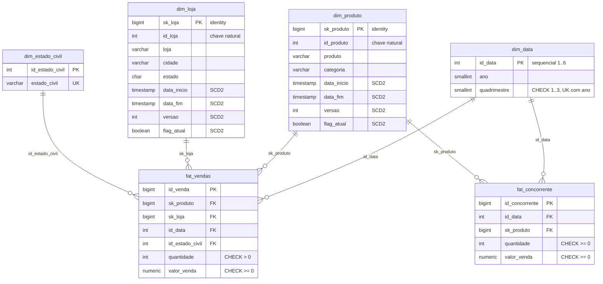

# 01 — Modelo dimensional

## Visão geral

Star schema clássico em `public`, com **duas tabelas de fato independentes** que
compartilham duas dimensões (`dim_data` e `dim_produto`). Nenhuma dimensão é
compartilhada entre os fatos além dessas duas — `fat_concorrente` não tem loja
nem recorte demográfico.



## Grão dos fatos

| Fato | Grão declarado pelo modelo | Observação |
|---|---|---|
| `fat_vendas` | Um produto vendido em uma loja em um **quadrimestre**, com o estado civil do cliente | **Grão agregado**: uma linha por combinação das quatro dimensões — 1.382 linhas. `id_venda` deixou de ser o número do pedido e passou a codificar a própria combinação. Ver [07](07-bloqueios-de-modelagem.md#1-fat_vendas--pk-incompatível-com-o-grão) |
| `fat_concorrente` | Um produto do concorrente em um **quadrimestre** | Sem loja e sem recorte demográfico. A fonte real não tem produto e é **mensal**: os 4 meses são somados na carga — ver [07](07-bloqueios-de-modelagem.md#2-fat_concorrente--fonte-incompatível-com-o-modelo) |

> **Atenção ao grão.** `fat_vendas` **não** está no grão de item. Os 6.621
> itens das fontes são agregados em **1.382 linhas**, uma por produto x loja x
> quadrimestre x estado civil — exatamente as quatro FKs que a tabela declara.
> `quantidade` e `valor_venda` são somas.
>
> Consequência: no schema `public` não existe data da venda, número de pedido,
> nem contagem de itens. Faturamento, unidades e todos os indicadores do
> projeto continuam exatos, mas **quantidade de pedidos, itens por pedido e
> ticket médio não são deriváveis do DW** — dependem de `stg.cln_fat_vendas`,
> que preserva o grão de item, a data real e o número do pedido de origem.

### Métricas

Ambos os fatos têm as mesmas duas métricas aditivas:

- `quantidade` (integer) — aditiva em qualquer dimensão
- `valor_venda` (numeric(14,2)) — aditiva em qualquer dimensão

Não há métrica semi-aditiva nem non-additive. Não há preço unitário armazenado:
ele é derivável (`valor_venda / quantidade`), mas isso pressupõe que
`valor_venda` seja o valor **total da linha**, não o unitário. A convenção não
está registrada no banco (não há `COMMENT` em nenhuma coluna) — ver
[decisão pendente](06-ingestao-e-staging.md#decisões-pendentes).

## Estratégia de dimensões lentamente mutáveis (SCD)

O modelo usa **duas estratégias diferentes**:

| Dimensão | Tipo | Mecanismo |
|---|---|---|
| `dim_produto` | **SCD tipo 2** | `data_inicio` / `data_fim` / `versao` / `flag_atual` + surrogate key `sk_produto` |
| `dim_loja` | **SCD tipo 2** | idem |
| `dim_estado_civil` | **SCD tipo 1 / estática** | Só `id_estado_civil` + `estado_civil`. Sem versionamento |
| `dim_data` | Estática | Dimensão de calendário quadrimestral, imutável |

### Como o SCD2 é garantido pelo banco

As duas dimensões SCD2 têm garantias declarativas fortes — não é só convenção
de ETL:

```sql
-- impede que duas versões do mesmo produto tenham vigências sobrepostas
CONSTRAINT ex_produto_per EXCLUDE USING gist (
    id_produto WITH =,
    tsrange(data_inicio, data_fim) WITH &&
)
-- impede vigência invertida
CONSTRAINT ck_dim_produto_per CHECK (data_fim > data_inicio)
-- garante no máximo UMA versão corrente por chave natural
CREATE UNIQUE INDEX ux_produto_atual ON dim_produto (id_produto) WHERE flag_atual;
```

**Consequência prática para o ETL:** não é possível inserir uma versão nova sem
antes fechar a anterior (`data_fim` + `flag_atual = false`). O banco rejeita.
A carga de dimensão é obrigatoriamente um passo de dois comandos, calculado a
partir de um delta — o que exige uma área de staging. Ver
[06](06-ingestao-e-staging.md).

O `data_fim` default é `'9999-12-31 00:00:00'` (registro corrente aberto).
O `tsrange(data_inicio, data_fim)` é **semiaberto** `[inicio, fim)`, então
fechar uma versão com `data_fim = X` e abrir a próxima com `data_inicio = X`
não gera sobreposição. É o comportamento desejado.

### Chave natural vs. surrogate

| Dimensão | Chave natural | Surrogate |
|---|---|---|
| `dim_produto` | `id_produto` (integer) | `sk_produto` (bigint identity) |
| `dim_loja` | `id_loja` (integer) | `sk_loja` (bigint identity) |
| `dim_estado_civil` | `estado_civil` (unique) | `id_estado_civil` — **não é identity**, o ETL fornece |
| `dim_data` | `(ano, quadrimestre)` — `uq_dim_data_ano_quad` | `id_data` (integer) — **não é identity**, o ETL fornece |

**Ponto crítico:** `id_produto` e `id_loja` são chaves naturais **globais** —
não existe coluna de origem/fonte na dimensão, e `ux_produto_atual` é único
sobre `id_produto` isolado. As três fontes usam IDs conflitantes para os mesmos
produtos, então essas chaves precisam ser **conformadas** antes da carga. Ver
[05](05-fontes-de-dados.md#colisão-de-chaves-naturais-de-produto).

## O que o modelo deliberadamente não guarda

Vale registrar as ausências, porque são decisões de escopo com consequência
analítica:

| Ausente | Consequência |
|---|---|
| **`dim_cliente`** | `nome`, `email`, `telefone`, `sexo`, `data_nascimento` das fontes são descartados. Só `estado_civil` sobrevive, degenerado como FK em `fat_vendas`. Análise por gênero ou faixa de idade é impossível |
| **Qualquer data no `public`** | `dim_data` é quadrimestral: só `ano` e `quadrimestre`. Análise mensal ou diária é impossível no DW, e a fonte do concorrente (mensal) é agregada na carga. Ver [07](07-bloqueios-de-modelagem.md#3-dim_data--grão-quadrimestral) |
| **Fato de serviços** | Itabuna tem 300 atendimentos (`banho`, `tosa`, `consulta veterinária`) sem tabela de destino |
| **`dim_categoria`** | Categoria é atributo textual desnormalizado em `dim_produto`, não dimensão própria. Coerente com star schema |
| **Preço de tabela / custo** | Sem custo não há margem. Só receita |

## Rastros de versões anteriores do modelo

Os catálogos mostram colunas removidas (`attnum` com buracos), indicando que o
modelo foi refatorado no lugar:

| Tabela | Posições removidas | Leitura provável |
|---|---|---|
| `dim_data` | 3 | Era `mes` ou `trimestre`, entre `ano` e `quadrimestre`. A tabela foi reconstruída no grão quadrimestral — ver [07](07-bloqueios-de-modelagem.md#3-dim_data--grão-quadrimestral) |
| `dim_estado_civil` | 1, 4, 5, 6, 7 | Era SCD2 (`sk`, `data_inicio`, `data_fim`, `versao`, `flag_atual`), foi rebaixada para estática |
| `fat_vendas` | 3, 9 | Uma entre `sk_produto` e `sk_loja`; outra após `id_estado_civil` |
| `fat_concorrente` | 6 | Uma após `valor_venda` |

Como não há migrations versionadas, **não há registro do que essas colunas
eram**. Ver [06](06-ingestao-e-staging.md#pendências-de-infraestrutura).
